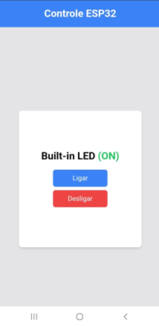

# Projeto ESP32 - Controle de LED via Web

Este projeto implementa um servidor web em um ESP32 que permite controlar o LED embutido da placa através de uma interface web responsiva.

<p align="center">
  
   
</p>

## Funcionalidades

- Interface web responsiva usando Tailwind CSS
- Controle do LED embutido (ON/OFF) via botões
- Feedback visual do estado do LED
- Conexão WiFi automática

## Requisitos de Hardware

- ESP32 DevKit v1
- Rede WiFi disponível

## Configuração

1. No arquivo `main.cpp`, configure as credenciais da rede WiFi:
   ```cpp
   const char* ssid = "SEU_WIFI";
   const char* password = "SUA_SENHA";
   ```

## Como Usar

1. Faça o upload do código para o ESP32
2. Abra o monitor serial para ver o endereço IP atribuído
3. Acesse o endereço IP através de qualquer dispositivo conectado à mesma rede WiFi

## Estrutura do Projeto

- `src/main.cpp`: Código principal do projeto
- Interface web embutida no código usando HTML, Tailwind CSS e JavaScript

## Tecnologias Utilizadas

- Framework Arduino
- ESP32 WiFi
- WebServer
- Tailwind CSS
- HTML/JavaScript